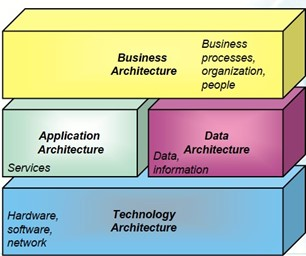

- 👋 Hi, I’m @frodeefteland
- 👀 I’m interested in collaboration across Aker BP
- 🌱 I’m currently learning how to write this readme. 
- 💞️ I’m looking to collaborate on Data Architecture & Modelling in Aker BP. 
- 📫 How to reach me: search me up on Teams.

- MarkDown guide: (https://guides.github.com/features/mastering-markdown/

- Digital Handbook is located here: https://kind-forest-0744b5603.3.azurestaticapps.net/

<!---
frodeefteland/frodeefteland is a ✨ special ✨ repository because its `README.md` (this file) appears on your GitHub profile.
You can click the Preview link to take a look at your changes.
--->

# Data Architecture Guidelines: 
[Guideline formatted as Word are hosted at Aker BP DataOps sharepoint site](https://akerbp.sharepoint.com/:w:/r/sites/abp-team-365/Shared%20Documents/2.01%20-%20GOVERNANCE%20AND%20ARCHITECTURE%20%F0%9F%A7%A9/1.01.03.%20Data%20Governance/78-000623%20Information%20Management%20Specification/Data%20Management%20Spec%20-%20Redesign%206.2023/Guideline%20Data%20Architecture.docx?d=w6f1b054f86884d898c3ee73192115ac8&csf=1&web=1&e=VJzXNd)

**Purpose:** The goal of this document is to describe a holistic methodology for creating and managing data architecture in Aker BP.  
The document structure focuses on what most architects want – more, better, and relevant guidance on how to deliver the best solution that supports their stakeholders and their organization.

**Valid for:**	Primary audience are roles within Architect and Digital Practitioners community in Aker BP.
Secondary is management level, to get high level insight into Data Architecture on Enterprise level. 

## 1 Executive Summary
Data architecture is like the blueprint for how data is organized, stored, and accessed within an organization. It outlines the structure and relationships of data, making it easy to find and use information effectively to make data driven decisions. Think of it as the foundation that ensures data is well-organized, secure, and readily available for various business needs and applications.

This document provides a comprehensive overview of the Data Architecture for our enterprise Aker BP. It highlights the purpose and significance of Data Architecture and emphasizes the benefits of adhering to the TOGAF standardization. Additionally, it outlines the typical risks associated with Data Architecture and provides definitions and abbreviations for clarity.
The Data Architecture overview explains the relationships between different architecture domains and outlines key components and the TOGAF metamodel.
The document further covers fundamentals and guidelines, stressing the importance of business and requirements analysis and providing best practice guidelines for various aspects, such as Data Product, Reference Architecture, Conceptual Model, Data Platforms, and Logical Blueprint. Master Data Dictionary and version control are also addressed.
The Data Architecture Framework introduces the TOGAF Architecture Development Method (ADM), Architecture Repository, and its key attributes, including lifecycle, approval state, abstraction levels, structure, and building blocks.
Data Governance, Data Modelling Standards, Data Integration, Data Security, and Privacy are highlighted as critical areas of focus, followed by an overview of Data Architecture Tools and Technologies.
Lastly, the document emphasizes the importance of Data Architecture Governance and concludes by providing references for further exploration.

This comprehensive guide aims to support our enterprise in implementing an efficient, standardized, and secure Data Architecture that aligns with industry best practices and enhances decision-making capabilities.

## 2 Introduction
### 2.1	The purpose of Data Architecture

The purpose of data architecture is to provide a structured approach to managing and organizing Aker BP's data assets. It involves designing and implementing a blueprint that outlines how data will be collected, stored, integrated, and used to support business operations, decision-making, and strategic initiatives.

#### Analogies to Data Architecture

1. **Library Catalog System**: Imagine a data architecture as a library catalog system. Each book (data) has a specific place on the shelf (data storage), categorized and organized based on different criteria (data structures). The catalog system (data architecture) helps you quickly find the book you need (data access), ensuring a smooth and efficient library experience.

2. **Building Blueprint**: Data architecture is like a blueprint for a building. It defines the layout, structure, and connections between different rooms (data entities), ensuring a well-designed and functional building (data system). Without a blueprint (data architecture), the building's construction (data organization) might lack coherence and cause confusion.

3. **Road Network**: Think of data architecture as a road network in a city. Roads (data paths) connect various locations (data sources and destinations), guiding traffic flow (data flow) and ensuring people can reach their destinations efficiently (data access).

4. **Kitchen Organization**: Data architecture is akin to organizing a kitchen. Each utensil, ingredient, and tool (data) has a designated place (data storage), making it easy to find what you need while cooking (data retrieval) and maintaining a tidy kitchen (data management).

5. **Puzzle Assembly**: Data architecture is like assembling a jigsaw puzzle. Each puzzle piece (data element) has a specific location and role, and fitting them together correctly (data integration) creates a clear and coherent picture (data insights).

6. **Conveyor Belt**: The data value chain can be compared to a conveyor belt in a factory. Raw materials (data sources) enter the conveyor belt (data ingestion), and as they pass through various stages of processing (data transformation), they become refined and valuable products (data insights) ready for use in decision-making and business operations. Data architecture acts as the well-calibrated machinery that ensures the smooth flow of data along the conveyor belt, optimizing data processing and value generation.

### 2.2 Significance of Data Architecture
Data Architecture plays a vital role in enabling Aker BP to effectively manage and leverage its data assets. It promotes data consistency, integrity, security, and usability, ultimately supporting better decision-making, operational efficiency, and competitive advantage within the enterprise architecture context.

- **Business Process Optimization** By understanding how data flows through our systems, we can identify areas for improvement and automation. This leads to more efficient operations and better utilization of our resources.

- **Data Integration and Consistency** Ensures that our data is seamlessly integrated across different systems and applications. This means we can have a unified view of our data, avoiding duplication and ensuring consistency in how we use and share information.
Reduces costs associated with data duplication, data errors, and manual data reconciliation.

- **Data Quality and Integrity** Helps us maintain the quality and integrity of our data. By setting standards and guidelines, we can ensure our data is accurate, complete, and reliable. This is crucial for making informed decisions and avoiding mistakes based on incorrect or incomplete information.

- **Data Security and Privacy** Addresses the security and privacy of our data. It establishes measures to protect sensitive information, such as customer data or proprietary data. This ensures we comply with regulations and safeguards our reputation and the trust of our stakeholders.

- **Decision-making and Analytics** Provides a standardized and integrated view of our data. This means we can access and analyze relevant data easily, enabling us to make informed decisions based on accurate information. It also supports our efforts in leveraging data analytics to gain valuable insights for strategic planning and operational improvements.

- **Scalability and Adaptability** A well-designed data architecture allows us to scale our data infrastructure as our organization grows. It also ensures we can adapt to new technologies and changing business needs. This flexibility is crucial in a rapidly evolving digital landscape.

- **Alignment with Business Strategy** Ensures our data assets align with our business strategy. It helps us identify critical data elements and define ownership and accountability. This ensures that our data supports our strategic goals and helps us stay ahead of the competition.

 ## 2.2 Benefits of TOGAF Standardization

Aker BP utilizes the TOGAF Architecture Development Method (ADM) as the process for architectural development. This choice is based on leveraging the valuable best practices offered by The Open Group [1].

The benefits of TOGAF Standard:

- We don't need to invent from scratch to create another data-silo, but instead use the best practice framework to create enterprise-wide data management.

- It is free to use!

- Used by small, medium, and large commercial businesses, government departments, non-government public organizations, and defense agencies.

- A wide range of helpful guidance and how-to material empowers organizations to operate efficiently and effectively across a broad range of use-cases, including agile enterprises and Digital Transformation.

- Created to balance between general concepts that apply to everyone and the specific details that can vary from case to case.

- Provides a common language and framework for communication and collaboration with stakeholders.

- Promotes scalability and adaptability to changing business needs and emerging technologies.

- Offers reference architecture, risk principles, and architecture toolbox.

- Known for its frequent updates and reflects the latest advancements in the industry, whereas the DAMA Body of Knowledge has relatively slower updates.

[1]: [The Open Group](https://www.opengroup.org/)  
